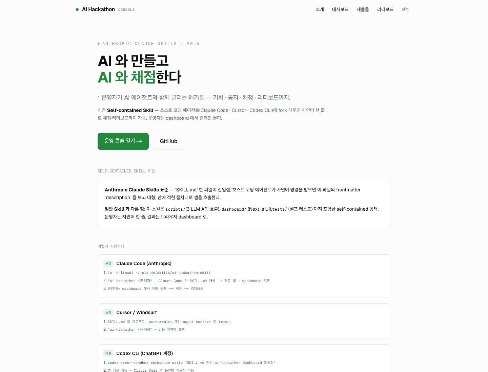
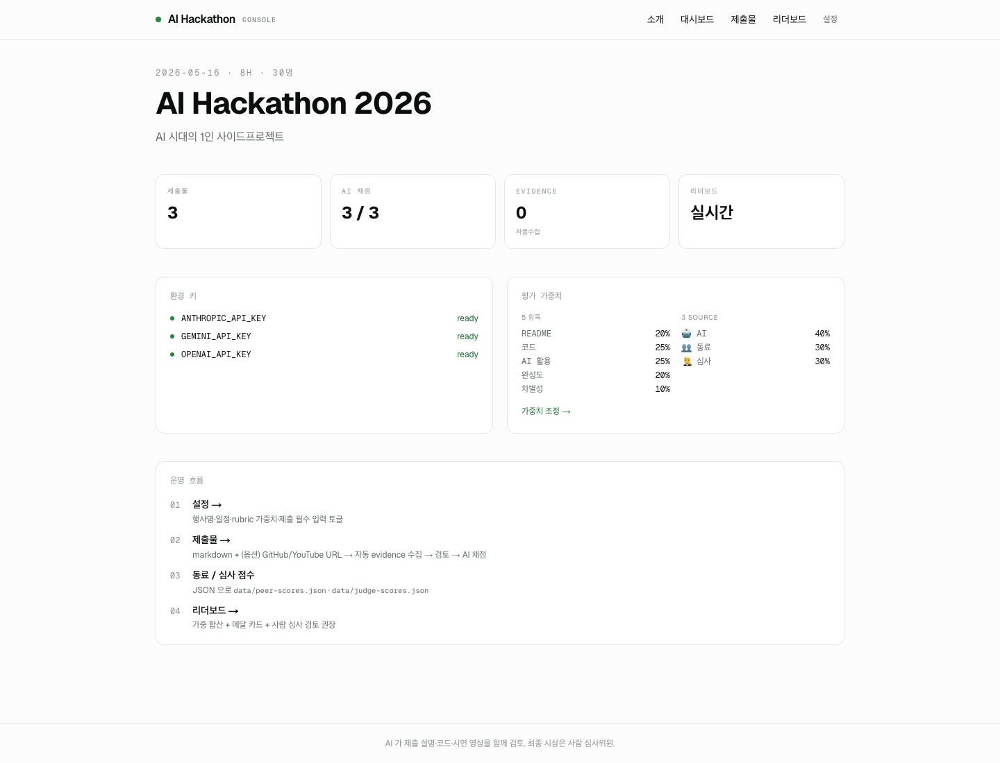
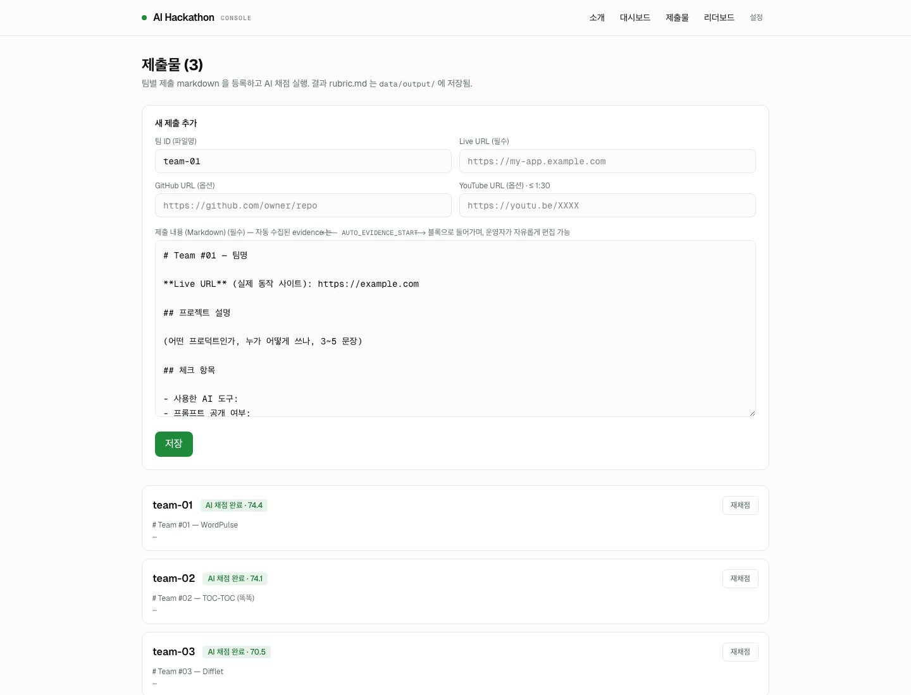
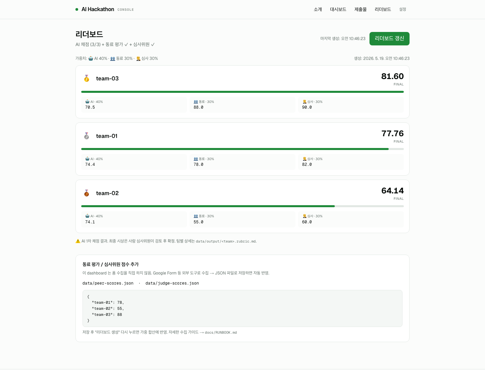

# ai-hackathon-skill

> **AI 와 만들고 AI 와 채점한다 — 1 운영자가 AI 에이전트와 함께 굴리는 해커톤.**

이건 **Anthropic Claude Skills 표준 Self-contained Skill** 입니다.
호스트 코딩 에이전트(Claude Code · Cursor · Codex CLI)에 fork 해두면 자연어 한 줄로
기획 · 채점 · 리더보드까지 자동. 운영자는 dashboard 에서 결과만 본다.

3 모델 (Claude · Gemini · OpenAI) 이 팀 설명 · GitHub 코드 · YouTube 시연 영상을
**함께 검토** 하여 독립 채점, 동료 평가 · 심사위원과 가중 합산. MIT.

## 미리보기

| 소개 페이지 | 대시보드 |
|---|---|
|  |  |
| **제출물** — 4-step UX (markdown + URL → evidence → 검토 → 채점) | **리더보드** — 메달 카드 + AI · 동료 · 심사위원 가중 합산 |
|  |  |

## Self-contained Skill 이란

**SKILL.md** 한 파일이 진입점. 호스트 코딩 에이전트가 자연어 명령을 받으면
이 파일의 frontmatter `description` 으로 매칭, 안의 절차대로 셸을 호출합니다.

일반 Anthropic Skill (prompt + template 만) 과 다른 점:
이 스킬은 `scripts/` (3 LLM API 셸 호출) · `dashboard/` (Next.js UI) · `tests/` (셀프 테스트)
까지 포함한 **self-contained** 형태. 운영자는 자연어 한 줄, 결과는 브라우저 dashboard 로.

## 사용 방법 (호스트 환경별)

### 1. Claude Code (Anthropic) ⭐ 권장 — 1급

```bash
# 사전 준비 (1 회)
brew install jq curl bun git
git clone https://github.com/gd452/ai-hackathon-skill ~/Development/ai-hackathon-skill
ln -s ~/Development/ai-hackathon-skill ~/.claude/skills/ai-hackathon   # 글로벌 등록
cd ~/Development/ai-hackathon-skill/dashboard && bun install
cat > .env.local <<'EOF'                                                # API 키 3 개
ANTHROPIC_API_KEY=sk-ant-...
GEMINI_API_KEY=...
OPENAI_API_KEY=sk-...
EOF
chmod 600 .env.local
```

이후부터 Claude Code 안에서:

```
"ai-hackathon 시작해줘"
```

→ Claude Code 가 `SKILL.md` description 으로 자동 매칭 → 안내된 절차대로
`bun run dev` 실행 → `http://localhost:3000` 자동 오픈 → 운영자는 dashboard 에서 작업.

### 2. Cursor / Windsurf ⭐ 권장

- 프로젝트 `.cursorrules` 에 `SKILL.md` 내용 import (또는 agent context 로 첨부)
- 그 후 같은 자연어 흐름 — `"ai-hackathon 시작해줘"`

### 3. Codex CLI (ChatGPT 계정) — 가능

```bash
codex exec --sandbox workspace-write \
  --cd ~/Development/ai-hackathon-skill \
  "SKILL.md 따라 ai-hackathon dashboard 띄워줘"
```

셸 접근 가능 → Claude Code 와 동일한 자동화.

### 4. ChatGPT 웹 · Gemini 웹 — UI 수동

웹 브라우저 환경은 파일 시스템 / 셸 접근이 없습니다. 자동화는 불가능하지만
dashboard UI 는 그대로 동작:

```bash
# 운영자가 직접
cd ~/Development/ai-hackathon-skill/dashboard
bun run dev   # → http://localhost:3000
```

이후 브라우저에서 제출 등록 → AI 채점 (내부적으로는 동일하게 3 모델 자동 호출).

## 운영 흐름

`http://localhost:3000` 에서:

| 페이지 | 역할 |
|---|---|
| `/` 소개 | Skill 사용법 · 호스트 환경별 안내 |
| `/console` 대시보드 | 행사 정보 · 환경 키 · 가중치 요약 |
| `/submissions` 제출물 | markdown + 옵션 GitHub/YouTube URL → 자동 evidence 수집 → 운영자 검토 → AI 채점 |
| `/leaderboard` 리더보드 | 🥇🥈🥉 메달 + AI · 동료 · 심사위원 가중 합산 |
| `/config` 설정 | 가중치 슬라이더 + 제출 입력 필수/옵션 토글 |

## 스킬이 진짜 동작하는지 셀프 테스트

```bash
bash tests/e2e/run.sh
```

`dashboard/.env.local` 의 키 3 개를 자동 로드 → 3 빌더 모델이 가상 팀 산출물 생성 →
3 심사 모델이 9 호출로 채점 → 리더보드. 약 1 분 30 초.
자세히 → [`tests/e2e/README.md`](./tests/e2e/README.md).

## 더 알아보기

- [`SKILL.md`](./SKILL.md) — Anthropic Claude Skills 표준 진입점 · 평가 모델 · 보안 · Boundary
- [`docs/RUNBOOK.md`](./docs/RUNBOOK.md) — 운영자 가이드 (참가 신청 폼 · 발송 채널 · 동료/심사 폼 · 결과 알림)
- [`BUILD_LOG.md`](./BUILD_LOG.md) — 어떻게 만들었는지의 기록

## 보안

- API 키 = 환경변수만 (`.env.local`, gitignored)
- 외부 호출 = LLM API + public GitHub HTTPS clone (옵션) + YouTube URL Gemini Video (옵션)
- GitHub evidence 수집 — 보안 가드 11 개 (`https://github.com/<owner>/<repo>` allowlist · sandbox · timeout · size cap · symlink/binary 제외 · prompt injection 방어 등)
- AI 채점은 보조 도구 — 최종 시상 결정은 사람 심사위원

## 라이선스

MIT — 자유 사용·수정·재배포.

작성 도구: Claude Code (Opus 4.7) + Codex CLI (GPT-5.5) 교차검증.
